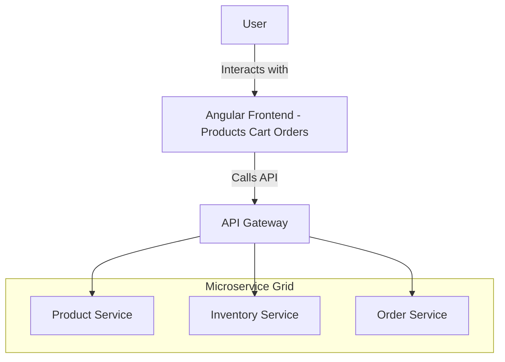
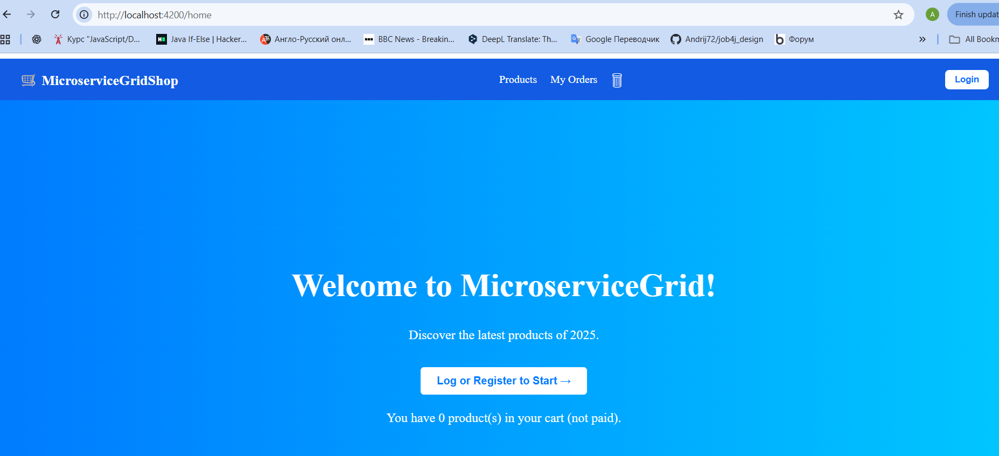
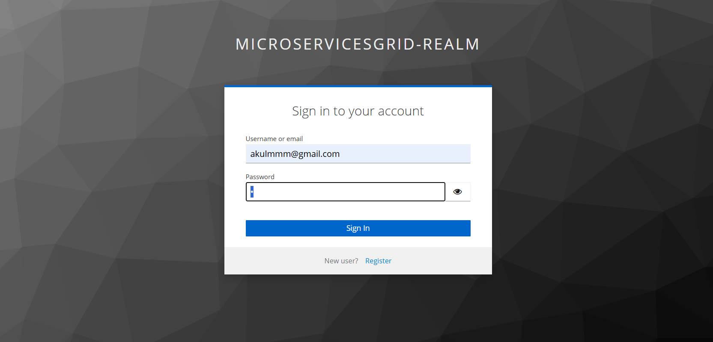
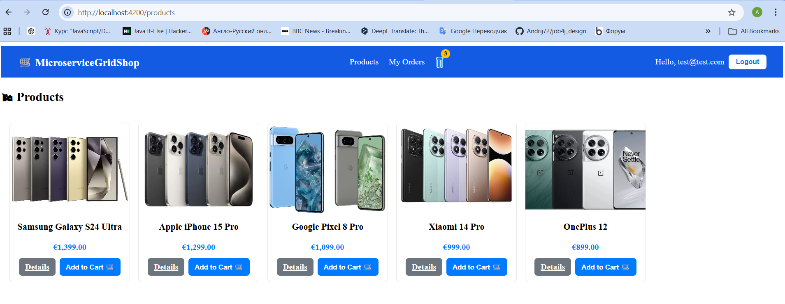
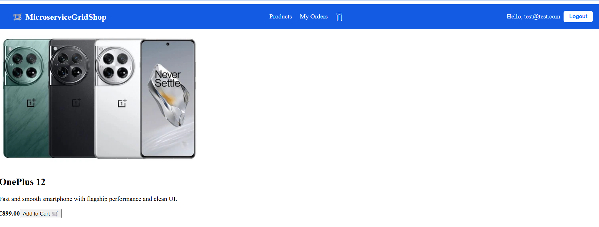
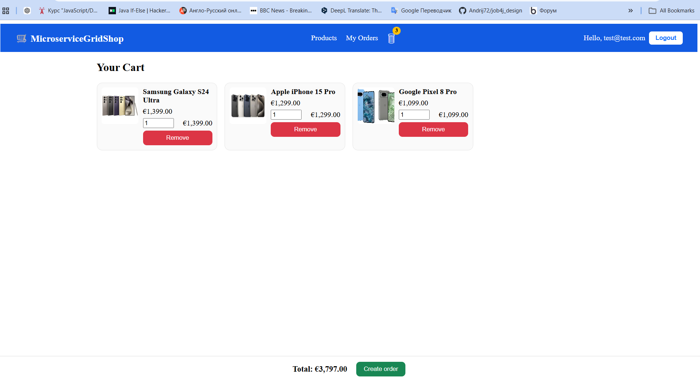
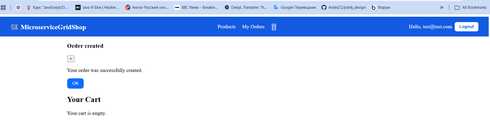
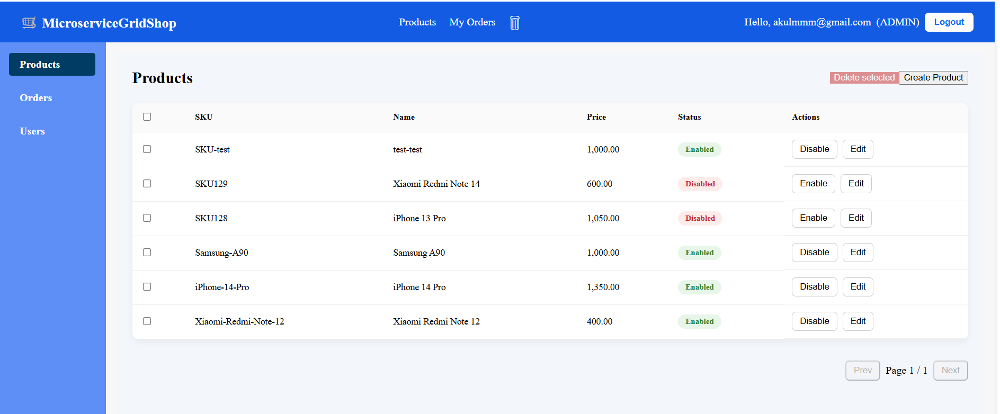
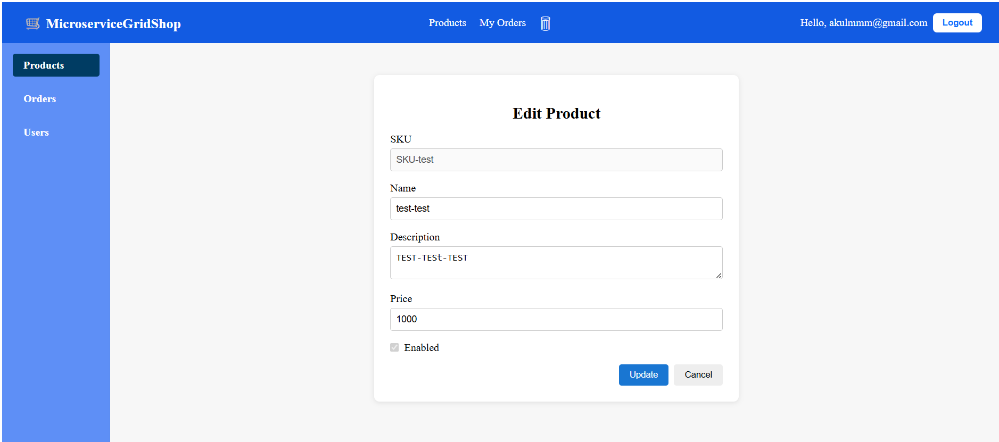
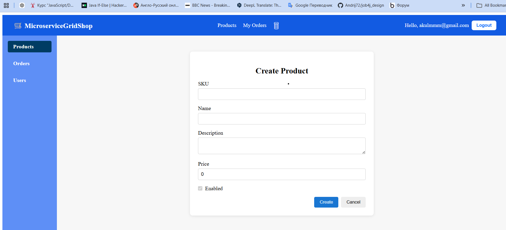

# 🛍️ MicroserviceGridShopFrontend 🅰️

**MicroserviceGridShopFrontend** is the frontend application of the **Microservice Grid** ecosystem.  
This Angular-based client communicates with the API Gateway and backend microservices to deliver a modular and scalable shopping interface.


# Admin Panel for E-Commerce Platform


Admin panel for managing products, orders and users.  
Built with Angular 20 and designed to work with a microservice backend architecture.

---

## 🚀 Features

- Product catalog fetched from **Product Service**
- Inventory availability from **Inventory Service**
- OrderService creation through **OrderService Service**
- Secure integration via **API Gateway**
- Angular 20 standalone architecture
- Modular structure prepared for future expansion (Cart, Auth, Payments, Admin Panel)

---

## 🛠️ Tech Stack

- **Angular 20**
- **TypeScript**
- **RxJS**
- **Angular Router**
- **SCSS**
- **REST communication through API Gateway**
- **Docker-ready production build**

---

## 📦 Project Structure
```text
src/
  app/
    core/
      auth/
        auth.config.ts
        auth.interceptor.ts
      header/
        header.component.html
        header.component.scss
        header.component.ts
    order/
      data-access/
        cart.service.ts
        order.service.ts
      feature-cart/
        cart.component.html
        cart.component.scss
        cart.component.ts
      feature-orders/
        orders.component.html
        orders.component.scss
        orders.component.ts
      model/
        cart-item.model.ts
        order-create.request.ts
        order.model.ts
    product/
      data-access/
        admin-product.service.ts
      feature-list/
        product-list.component.html
        product-list.component.scss
        product-list.component.ts
      feature-details/
        product-details.component.html
        product-details.component.scss
        product-details.component.ts
      model/
        admin-product.model.ts
    pages/
      admin/
      home/
```

---
## 🔌 API Integration

| Endpoint          | Method | Description              |
|-------------------|--------|--------------------------|
| /api/v1/products  | GET    | Fetch all products       |
| /api/v1/inventory | GET    | Check stock availability |
| /api/v1/orders    | POST   | Create order  <br/>      | 

**Order Payload Example**
```json
{
  "items": [
    {
      "sku": "iphone-15",
      "productName": "iPhone 15",
      "price": 999,
      "quantity": 1
    }
  ],
  "userDetails": {
    "email": "user@test.com",
    "firstName": "John",
    "lastName": "Doe"
  }
}
```
---

## 📈 User Flow / Architecture Diagram



---
 

## 📸 Screenshots

#### Home


#### Login


### Client Dashboard


### Product details


#### Client Cart 


#### Create order


### Admin Dashboard
#### Product List (Grid View)


#### Product Edit Form


#### Create new Product Form


---
## ⚙️ Development Setup

### 1. Install dependencies

```bash
npm install
```
2. Start the development server
```bash
ng serve
```
Open in browser:

http://localhost:4200/
Hot-reload works automatically.

## 🧱 Production Build
```bash
ng build --configuration production
```
The build output will be generated inside the:
```bash
dist/microservice-grid-shop-frontend/
```
You can serve it using Nginx, Docker, or any static hosting.

---

## 🧪 Code Scaffolding
Generate new components:
```bash
ng generate component component-name
```
View all available schematics:
```bash
ng generate --help
```

---

## 🔌 API Integration
All backend communication goes through the API Gateway:

Endpoint	Description
/api/v1/products	Product catalog
/api/v1/inventory	Inventory check
/api/v1/order	Create order

Environment config:
``` bash
src/environments/environment.ts
```
---

## 🧰 Docker Build (optional)
``` bash
docker build -t microservice-grid-frontend .
docker run -p 4200:80 microservice-grid-frontend
```
---

## 🔮 Planned Features
 - Keycloak Authentication (Login / Register)

 - User profile & session handling

 - Shopping cart & checkout page

 - Payment interaction via Pay Service

 - Admin Dashboard (Products, Inventory, Orders)

 - Weather & Currency integration widgets

---

## 👤 Author
Andrii Kulynch
Part of the Microservice Grid distributed system.
